# Project IO433

```
 ___ ___  _ _ ________
|_ _/ _ \| | |__ /__ /
 | | (_) |_  _|_ \|_ \
|___\___/  |_|___/___/
                       
```

## Description

IO433 is an open-source ESP32 (TTGO T-Display) & CC1101 based 433Mhz sniffer. It is currently work in progress.
It can sniff, store, replay, dump and monitor most 433Mhz (currently ASK-OOK only) signals.
These include garage door openers, remote doorbells, sensors and similar devices.

The core of this project aims to be its simplicity, reliability and versatility.
With a couple of ICs and a by 'connecting some wires', or soldering a breakout board, one can start messing around with 433Mhz devices and decode their communications protocols.
It's mainly a proof-of-concept but already encompasses several very useful features.

```bash
│  # The current dir is a platformIO project and can be imported straight from here.
├── arduino  # an example arduino project that implements a remote for some ASK-OOK-PWM signals based on a FS1000A
├── docs     # docs and pictures
├── include  # project helper files 
├── lib    #some needed libraries with specific modifications for this project
├── libsigrokdecode   # a modified PWM decoder that shows bits and nibbles (sigrok/PulseView)
└── src # project main files
```

## Bill of Materials

| Qty. | Description | Obs. |
|------|------------------------|-----------------------------------------------------------------|
| 1 | ESP32 TTGO T-Display | ESP32 controller with a 1.14" LCD and two buttons for navigation |
| 1 | TI-CC1101 or E07-M1101D | CC1101 based modules for 433Mhz (and other frequencies) communications |
| 1 | io433 PCB| Order a PCB or etch one or just grab some wires :) |
| 1 | Battery | Optional 3.7v battery


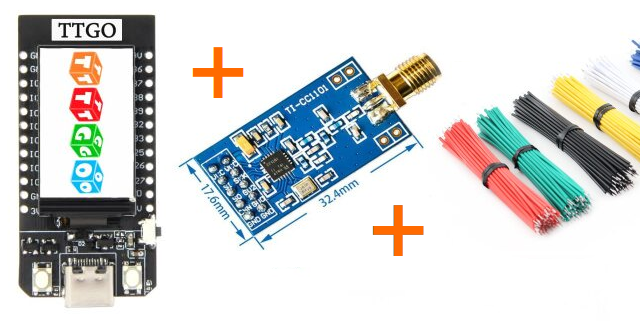
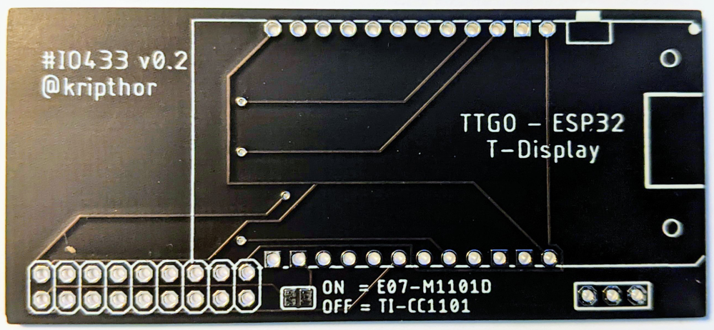

* All the components can be easily found in the usual online stores such as *AliExpress* ([ESP32 TTGO T-Display](https://aliexpress.com/wholesale?SearchText=ttgo+t+display+esp32)) - [CC1101](https://aliexpress.com/wholesale?SearchText=cc1101)), *Amazon*, *eBay*, etc.
* The breakout pcb and schematics files are under the docs/ directory: 
[IO433 Schematic](docs/breakout.sch)
[IO433 Board](docs/breakout.brd)


## IO433 Wiring

### Prototype photo and assembly suggestion


This is just a suggestion on how to wire the ESP32 and the CC1101. A perforated PCB can be used to make the prototype more sturdy. Or you can just order a pre-fabricated board, like the one bellow:

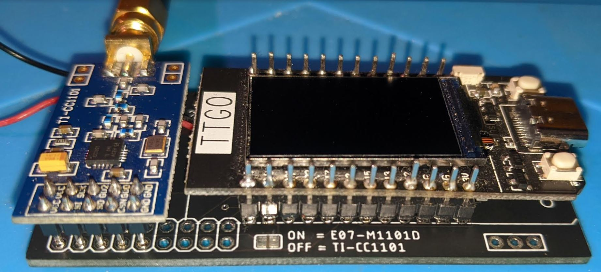

### IO433 Wiring


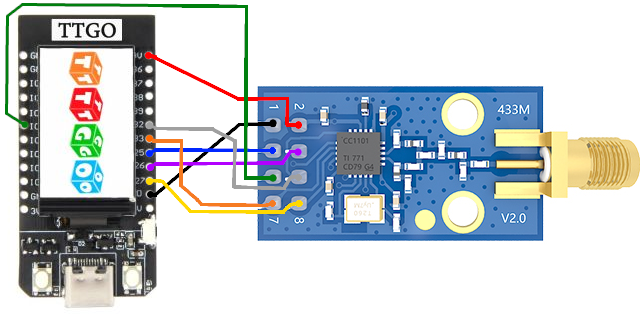

Details of the wiring between the ESP32 and TI-CC1101 (above) and the E07-M1101D (below). The pinout choosing is important. If changed, not only the code should change to reflect the new pinout, as one must make sure the corresponding ports on the ESP32 support the I/O operation mode that the code needs. 
* **Important note**: the green wire connects to IO2 on the ESP32, regardless of what you see in some pictures.
* **Important note 2**: You need to change the file ./include/CC1101utils.h to reflect which CC1101 model you are using.

### IO433 PCB Schematics
docs/breakout.sch
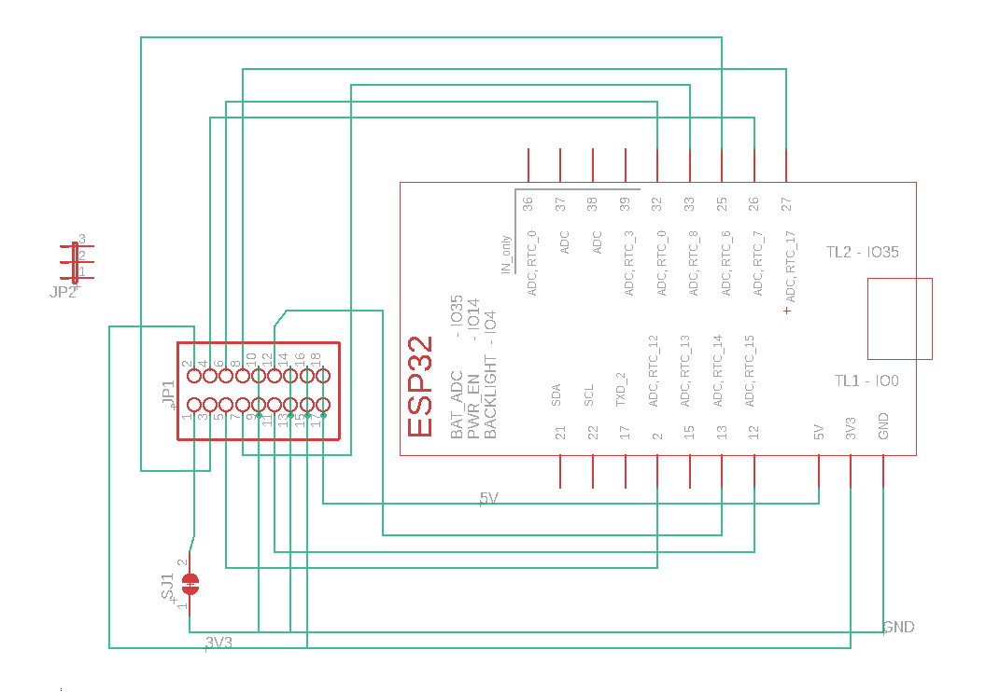
docs/breakout.brd
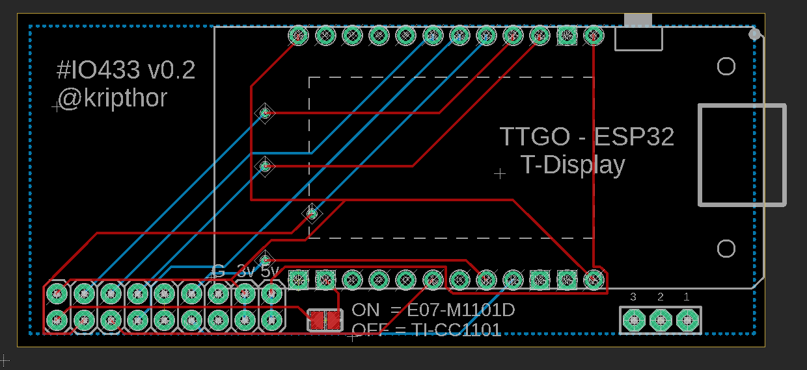

### Assembly with PCB

Solder the CC1101 based module in the lower leftmost side of the pcb. The E07-M1101D will have 2x4 pins and the TI-CC1101 will have 2x5 pins. If you are using the E07-M1101D, connect the solderable jumper in the lower middle.  

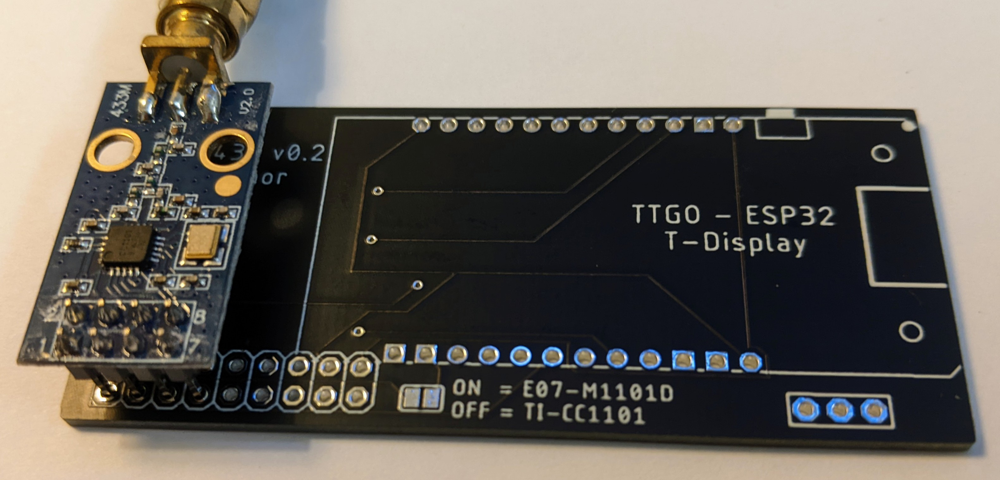

Then just solder the ESP32 TTGO module on the PCB. Add a battery or just use the USB cable to power the module. Optionally print the 3D case for your CC1101 module. 
I've made an Youtube video to show how to assemble it in less than half an hour: [IO433 Assembly on Youtube](https://www.youtube.com/watch?v=Nz-Mw6mhYjg)


### Assembly with battery and 3D printed case, no PCB

If you want, you can use the 3D printed case that supports a 902540 720mAh or even a 903048 1800mAh, 3.7V battery (should last for some days)
The full material is listed bellow:

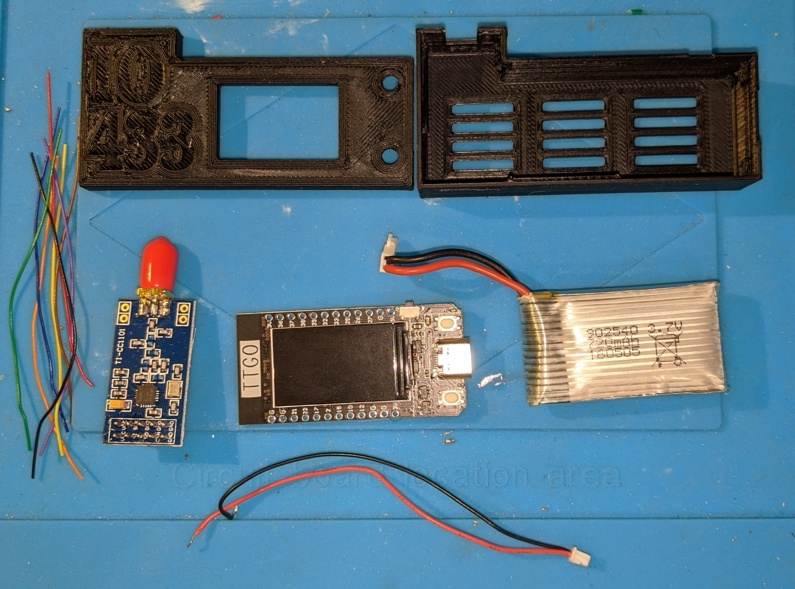
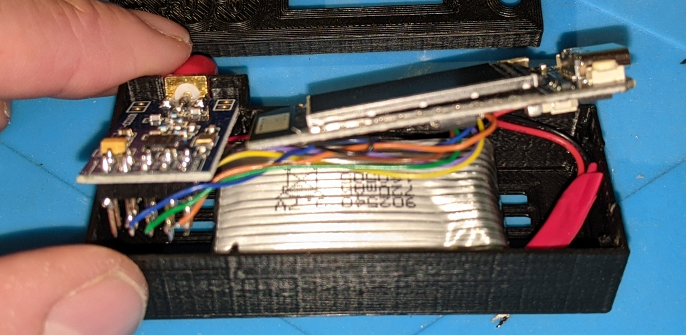
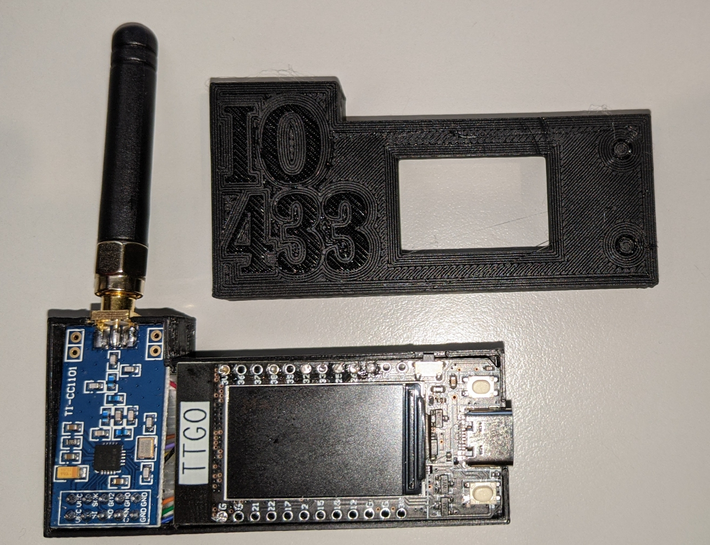
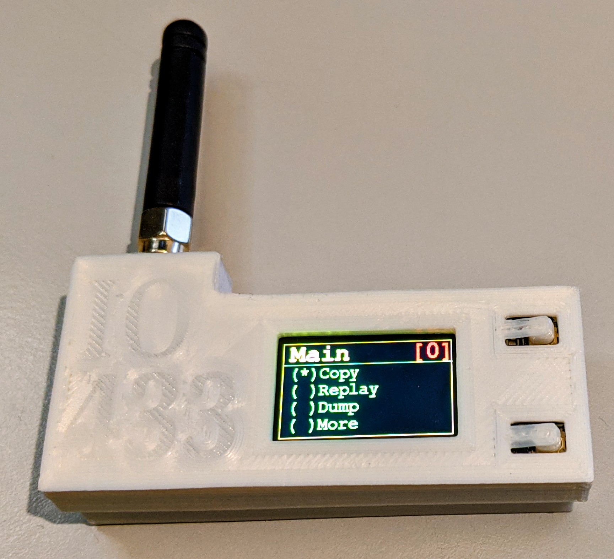

### 3D case

NO PCB version:
Tinker/download it from [tinkercad](https://www.tinkercad.com/things/bPiFpUXC7pQ)
or grab the STL from the [docs](docs/IO433.stl)

PCB Version:
Tinker/download, both TI-CC1101 and E07-M1101 versions, from  [tinkercad](https://www.tinkercad.com/things/0qDgP6hPqE1)


## How to flash IO433   

### Using [Platformio](https://platformio.org/)

* Install Visual Studio
* Install PlatformIO from the Extensions (restart)
* Install the Espressif 32 platform from the PlatformIO Embedded tab (restart)
* Clone the repository
* Change the file ./include/CC1101utils.h and uncomment your CC1101 version(either the TICC1101 or the E07M1101D)
* Connect USB-C cable to TTGO
* Build and upload

## How to use it

Plug the ESP32 to a battery or a to a USB-C cable. The current menu structure is the following:

```bash
│ Main
├── Copy   # Copy signal to current memory bank
├── Replay # Replay signal from current memory bank
├── Dump   # Dump current memory bank to screen and serial (fixed 100kbps, for easy analysis on third party software [ex. PulseView])
└── More
    ├── Monitor # Dump raw signal to screen and RSSI info
    ├── Raw Out # Dump current signal to serial as fast as possible (default 1Mbps serial)
    └── About   # About menu
```

## Button behaviour

* UP and DOWN short press, moves between menu items
* UP long press is moves back a level
* DOWN long press enters current submenu or function
* UP or DOWN double press moves back and forward from memory banks (to store/replay multiple signals) 

## Dependencies

This project uses:

 * Button2 lib (which should auto-update on build via platformio.ini)
 * SmartRC-CC1101-Driver-Lib (on /lib, added minor changes for the ESP32 TDisplay)
 * TFT_eSPI (on /lib, added minor changes for the ESP32 TDisplay)

# Improvements

There are many possibilities for improvements:

* Code refactoring. Make SimpleMenu a proper lib.
* Better SPIFFS management
* Configuration menus for changing output data rates and formats
* Configuration menus for CC1101 setup: frequencies, modulations, data rates and bandwidth
* Implement other modulations besides ASK-OOK
* Add upload data files from PC to be replayed
* Add accept from serial and transmit features
* and so forth...

Feel free to clone and play around, as well as to contribute and make a pull request.

## Kudos

* [LSatan](https://github.com/LSatan), for the SmartRC-CC1101-Driver-Lib
* the [TFT_eSPI Library](https://github.com/Bodmer/TFT_eSPI)
* Shameless README.md 'template' rip from [jpdias](https://github.com/jpdias)
